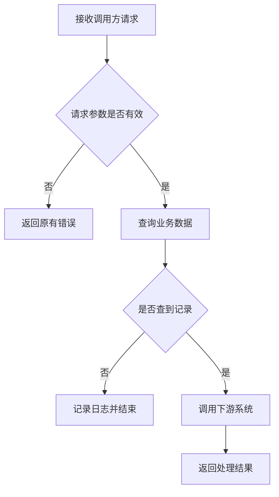

# 写作规则

写方案文档时必须遵守以下全部规则。

## 1. Why → What → How 叙事顺序

前三节（背景、目标、价值）让读者不看后文也能判断方案价值。不要上来就写接口定义。

## 2. 结论先行，简洁表达

文档是给评审、开发和联调看的，不是需求复述。每个章节**先写设计结果，再写必要说明**。

只保留四类内容：① 设计决策与理由；② 关键业务规则、主流程、接口契约、数据结构、系统影响；③ 需要他人确认的未知项。其余一律删除：需求复述、重复说明（同一信息全文档只出现一次）、常识与套话、无依据的推测性细节、为填满章节的扩写。

表达形式：一段只讲一个重点，优先短句和列表；简单内容简短表达；表格、流程图、代码块仅在明显提升理解时使用。

**精简底线**：关键业务规则、主流程、接口、数据结构和系统影响不得因精简而遗漏。

## 3. 事实与证据

- 现有接口、表、字段、配置、枚举和状态结论附 `文件:行号`。
- 新增内容标注“方案定义”；需求或代码均未确认的内容标注“未确认”与证据缺口。
- 已确认事实可以直接指导开发，但不得把推断写成现状。
- 仅当缺失信息会改变接口契约、数据模型、核心流程、兼容性或上线方式时阻塞追问。

## 4. 代码探索回退

优先使用 `codegraph_explore`。不可用或覆盖不完整时，使用 `rg --files` 定位候选文件、`rg -n` 搜索标识符，再定向读取入口、业务方法、数据层、客户端和配置文件。回退后仍无法确认的范围必须写明。

## 5. 业务流程用 Mermaid flowchart

业务流程必须使用 ` ```mermaid` 代码块和 `flowchart TD`，禁止用缩进文本图。

- `[]` 矩形表示动作，用动词开头的中文。
- `{}` 菱形表示判断，用问句结尾。
- `-->` 表示主线，`-->|标签|` 表示条件分支。
- 接口迁移或改造类方案同时提供旧流程和新流程。

示例：



## 6. 接口定义六件套

每个接口保留以下六项；不适用时明确写“不涉及”。

| 套件 | 内容 | 格式 |
|---|---|---|
| 地址 | 请求方法、路径、Content-Type | HTTP 代码块 |
| 请求规格 | 字段表与 JSON 示例 | 表格 + JSON |
| 返回规格 | 场景与返回对照 | 表格 |
| 内部查询逻辑 | SQL 条件或 ORM 参数 | 代码块或文字 |
| 下游推送参数 | 字段、类型、说明、赋值来源、示例 | 表格 |
| 处理规则 | 校验顺序、业务规则、特殊情况、日志规则 | bullet list |

字段表与 JSON 示例必须逐字段一致；JSON 中新增或遗漏字段都算校验失败。

## 7. 兼容约束与业务边界写“不做什么”清单

兼容要求放在第 5 节业务流程图之后，具体写明不新增限制、不改变顺序、不改变错误码、不改变缺失数据处理等已确认行为，不使用“保持原规格”代替细节。业务范围边界（本功能明确不做的事，如只维护配置不实现执行逻辑）与兼容约束分开列出。

## 8. 字段赋值用表溯源

下游参数或数据库字段映射必须有“赋值来源”列。来源写到具体请求字段、查询结果字段、常量、配置键或计算规则；未知时写“未确认”，不得按字段名猜。

## 9. 工程决策清单逐项保留

第 10 节工程决策清单的每个子节要么给出设计，要么写“不涉及”，不允许留空。子节以检查清单方式逐项过，不因“本次用不到”跳过标题。

## 10. 规划有门禁条件

第 13 节每个阶段写可验证的完成标准，不写“完成开发”“完成测试”这类无法独立判断的结果。完成标准必须对应本方案已有契约、数据或流程。

## 11. 任务排期不编造

第 14 节必须保留。用户未给出人员、工作量或发布日期时，使用阶段、前置依赖和产出描述，时间列写“未确认”；不得自行填写日期、人天或责任人。

## 12. 兜底方案可执行

第 15 节每个异常场景对应一条具体措施，写清动作和恢复对象。责任人或时限未确认时写“未确认”，不写“及时处理”“视情况回滚”。

## 13. 空节保留

模板 16 节及顺序固定。没有数据库变更写“不涉及数据库变更”，没有状态变化写“无状态变更”，其余按模板写“不涉及”。禁止新增模板未列出的顶层编号章节；备选方案与取舍仅在存在多个候选方案时写入 10.1。

## 14. 待确认事项集中成表

第 16 节待确认事项必须保留。无法从需求或代码确认、且影响实现的事项用“编号 + 待确认项 + 影响”列表集中记录；能落在具体章节的细节仍在对应节写“未确认”，两处不重复。禁止把已确认内容写进待确认事项。

## 15. 术语

英文缩写首次出现时标注英文全称和中文含义，后续可直接使用缩写。代码标识符、表名和配置键保持原文。

## 16. 生成后自检

保存前逐项检查：

- 正好保留模板 16 节，编号、标题和顺序一致，没有新增模板未列出的顶层编号章节。
- 第 10 节工程决策清单子节全部保留，每项要么有设计、要么写“不涉及”。
- 不存在 `{{...}}`、`xxx`、`TBD` 等占位符；允许的“未确认”必须同时说明证据缺口。
- 每个 Mermaid 代码块声明 `flowchart TD`，节点闭合，分支标签与正文一致。
- 每个接口的字段表与 JSON 示例字段、类型、必填性一致，六件套齐全或明确“不涉及”。
- 现状中的接口、表、字段、配置和状态均有来源；方案定义与现状没有混写。
- 第 13 节每个阶段都有可验证的完成标准。
- 第 14 节没有虚构排期、人员或工作量。
- 第 15 节每个异常场景都有可执行兜底措施。
- 第 16 节待确认事项均为真实缺口，没有已确认内容混入。
- **简洁自检**：通读全文，删除任何不影响方案理解和开发实施的句子；每个章节结论在说明之前；无需求复述、重复说明、套话和常识。

## 常见错误

| 错误 | 正确做法 |
|---|---|
| 删除不适用章节 | 保留标题并写“不涉及” |
| 工程决策子节留空 | 每项写设计或“不涉及” |
| 结论埋在说明后面 | 先写设计结果，再写说明 |
| 需求复述、抄需求 | 背景只写现状与痛点 |
| 同一信息多处重复 | 全文档只写一次 |
| 为填章节强行扩写 | 简单内容简短表达 |
| 未知信息写成确定事实 | 标注“未确认”与缺少的证据 |
| 业务流程用文本箭头 | 使用 Mermaid flowchart |
| 请求只给 JSON | 字段表和 JSON 示例同时提供 |
| 下游字段没有赋值来源 | 每个字段标注来源或“未确认” |
| 总体规划只有阶段名 | 给出可验证完成标准 |
| 排期凭经验填日期 | 未提供依据时写“未确认” |
| 兜底写“及时处理” | 写具体恢复动作 |
| 待确认事项混入已确认内容 | 只列真实缺口 |
| 同日文件直接覆盖 | 先判断更新还是序号新建 |


